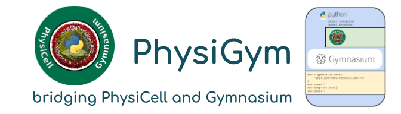

# Header:

+ Language: C++11 and Python [>= 3.8](https://devguide.python.org/versions/)
+ Software dependencies: PhysiCell v1.13.1
+ Python library dependencies: gymnasium, lxml, matplotlib, numpy, pandas, (ipython, PyQt6)
+ Author: Alexandre Bertin, Elmar Bucher
+ Date: 2024-spring
+ Doi:
+ License: [BSD-3-Clause](https://en.wikipedia.org/wiki/BSD_licenses)
+ User manual: this README.md file
+ Source code: [https://github.com/Dante-Berth/PhysiGym](https://github.com/Dante-Berth/PhysiGym)

# Abstract:

PhysiCell is a physics-based cell simulator for 3D multicellular systems.
More precisely, [PhysiCell](https://github.com/MathCancer/PhysiCell) is an agent-based model and diffusion transport solver that is off-lattice, center-based, multiscale in space and time, and written in [C++](https://en.wikipedia.org/wiki/C%2B%2B).

[Gymnasium](https://gymnasium.farama.org/main/) is the API standard for reinforcement learning, written in [Python3](https://en.wikipedia.org/wiki/Python_(programming_language)).

The Python3-based physigym module presented here was written on top of the python_with_physicell [embedding](https://github.com/elmbeech/physicellembedding) module, which makes it possible to interact with PhysiCell models in the Python3 language.

Both, physigym and embedding, are PhysiCell custom_modules.

Walking through the [tutorial](https://github.com/Dante-Berth/PhysiGym/blob/main/man/TUTORIAL_physigym.md), you will gain the understanding needed to tackle more complex PhysiCell-based reinforcement learning projects.
You will set up a very basic template model that can figure as a starting point for your own project.

May the force be with you!

# HowTo Guide:

+ [install and troubleshoot the physigym user_project](https://github.com/Dante-Berth/PhysiGym/blob/main/man/HOWTO_physigym.md)
+ [uninstall the physigym user_project](https://github.com/Dante-Berth/PhysiGym/blob/main/man/HOWTO_purge.md)

# Tutorial:

+ [physigym tutorial](https://github.com/Dante-Berth/PhysiGym/blob/main/man/TUTORIAL_physigym.md)

# Reference Manual:

+ [reference manual](https://github.com/Dante-Berth/PhysiGym/blob/main/man/REFERENCE.md)

# Discussion:

To be developed.

# About Documentation:

Within the PhysiGym library, we tried to stick to the documentation policy laid out by Daniele Procida in his "[what nobody tells you about documentation](https://www.youtube.com/watch?v=azf6yzuJt54)" talk at PyCon 2017 in Portland, Oregon.

# Contributions:

+ Concept and implementation: Alexandre Bertin, Elmar Bucher
+ Involved: Emmanuel Rachelson, Heber Lima da Rocha, Marcelo Hurtado, Paul Macklin, Randy Heiland, Vera Pancaldi, Vincent François

# Cite:

To be BibTeX.

# Road Map:

+ nop

# Release Notes:

+ 0.0.1 (2024-06-20): the basic physigym implementation works.
+ 0.0.0 (2024-04-15): physigym rises from the ashes.

