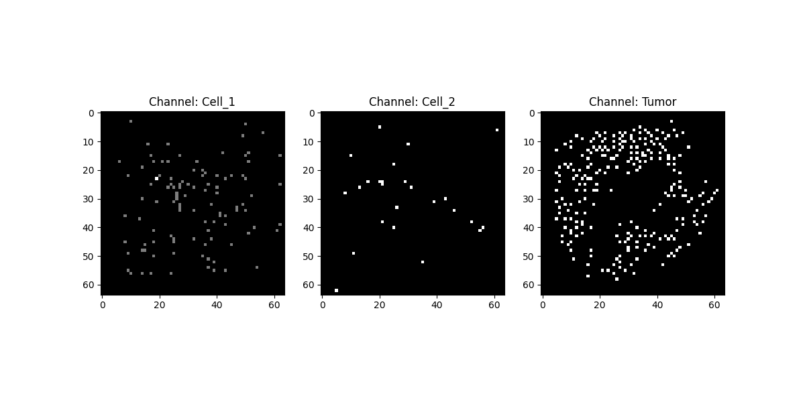
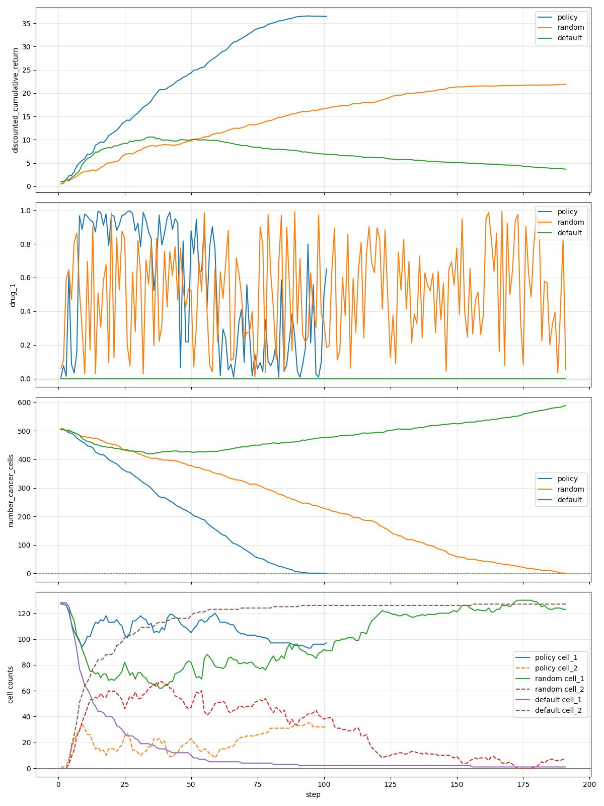

# PhysiGym and Reinforcement Learning with Gymnasium

In this tutorial, you will learn how to apply reinforcement learning (RL) to control a biological simulation model.
We use the **tumor immune base** (TIB) model as an example:
[tumor_immune_base](https://github.com/Dante-Berth/PhysiGym/tree/main/model/tumor_immune_base).

This model consists of three types of cells:
- **cell_1**: produces an anti-inflammatory factor that negatively impacts tumor cells by increasing the probability of apoptosis,
- **cell_2**: produces a pro-inflammatory factor that positively impacts tumor cells by decreasing the probability of apoptosis,
- **tumor cells**.

Under environmental pressure, cell type **cell_1** can transform into cell type **cell_2**.
The drug **drug_1** can reverse this transformation, turning cell type **cell_2** back into cell type **cell_1**.
Additionally, cell types **cell_1** and **cell_2** cells are attracted to debris in the environment.

For a detailed description of the rules governing cell behavior, see the [cell_rules.csv](https://github.com/Dante-Berth/PhysiGym/blob/main/model/tumor_immune_base/config/cell_rules.csv) file.


Before speaking reinforcement learning, let's install the model.


## Install, Load, and Compile the Model (Bash)

### 1. Install:

```bash
cd path/to/PhysiGym
python3 install_physigym.py tumor_immune_base -f
```


### 2. Load:


```bash
cd ../PhysiCell
make clean data-cleanup reset
make list-user-projects
make load PROJ=physigym_tumor_immune_base
```

#### 3. Compile:

```bash
make
```


## Applying Deep Reinforcement Learning on the Tumor Immune Base Model


### 1. Problem Statement

How can we find a treatment regime that reduces tumor size while minimizing drug usage?
In other words, we aim to learn a **Policy**  a mapping from states to actions that defines the optimal amount of drug to apply over time.

A suitable framework to solve this control problem is **Reinforcement Learning (RL)**, which we will use in this tutorial.

First, we will have to recall some important elements in Reinforcement Learning.


### 2. Reinforcement Learning short explanation

In reinforcement learning (RL), the goal is to **maximize the expected cumulative reward** over time. The **reward function** provides feedback to the agent, indicating how beneficial or harmful its actions are.

The RL agent interacts with an environment — such as our **TIB model** — which provides observations. These observations can be **scalars** or **images** (e.g., generated from an agent-based simulator). The agent processes this input to decide on an action.

In our TIB case, the **action** corresponds to the administration of a drug, denoted by:

$$
d_t \in [0, 1],
$$

at each time step.

After the action is taken, the agent receives a **reward** that reflects the effect of the drug on the tumor environment — for example, reducing tumor size while avoiding excessive drug use.

Through trial and error, the agent learns a strategy (policy) that balances these objectives over time.


#### Reinforcement Learning detailed

In Reinforcement Learning (RL), the objective is to maximize the **expected cumulative reward**:

```math
\underset{\pi}{\arg\max} \mathbb{E} \left[ \sum_{t=0}^{T} \gamma^t r_t \mid s_0 = s, \pi \right],
```

where:
- $\gamma$ is the discount factor.
- $r_t$ is the reward function.
- $\pi$ represents the policy (strategy).
- $s_0$ is the initial state derived from `cells.csv`.

RL frameworks are characterized by four essential elements that define a **Markov Decision Process (MDP)** $MDP = \{S,A,T,R\}$.
- $S$ the state space.
- $A$ the action space.
- T the transition $T(s_{t},a)=s_{t+1}$ is given by PhysiCell.
- $R: \mathbb{S}\times \mathbb{A}\times \mathbb{S} \to \mathbb{R}$ the reward is determined by the current action, the current state, and the subsequent state.
This feedback is provided to the agent to assess whether the action contributes to achieving its objective.

The agent aims to maximize the reward function by learning an optimal policy or strategy.
In the next section, we will use a deep reinforcement learning algorithm to solve this problem.

The **reward function** in this model is defined as:

```math
r_t = \alpha \cdot \frac{C_{t-1} - C_t}{\log(C_{init})} - (1-\alpha) \cdot d_t.
```
Where:
- $C_t$: Number of tumor cells at time step $t$.
- $C_{init}$ : Number of tumor cells at initial time step.
- $d_t$: Amount of drug added to the tumor microenvironment at time $t$.
- $\alpha \in [0, 1]$: A trade-off weight parameter.
  - $\alpha = 1$: Prioritize killing tumor cells, ignoring drug usage.
  - $\alpha = 0$: Avoid drug usage entirely, regardless of tumor growth.
This reward has two main components: $\frac{C_{t-1} - C_t}{\log(C_{init})}$ the reduction term encourages reduction in tumor size, where the numerator measures how many tumor cells were eliminated weighted by the denominator which normalizes the reward.
While the second term, $- (1 - \alpha) \cdot d_t$ refers as the drug penalty term.
Besides, the parameter $\alpha$ balances between **therapeutic effectiveness** (tumor killing) and **toxicity cost** (drug amount).
By adjusting $\alpha$, you can simulate different treatment strategies:
  - **Aggressive**: $\alpha \approx 1$ → Maximize tumor reduction, ignore drug cost.
  - **Conservative**: $\alpha \approx 0$ → Minimize drug use, even if tumor persists.
  - **Perfect Balanced**: $\alpha = 0.5$ -> Perfect Trade-off between treatment effectiveness and side effects.
  - **Balanced**: $\alpha \in (0, 1)$ → Trade-off between treatment effectiveness and side effects.
In this tutorial, we take $\alpha=0.5$.

The first **state space** in this model is **multi_channels** a multi-channel image where each channel corresponds to a specific cell type. For one of the channels, we also reduce the dimensionality. For instance for a grid size of $64$ and for our three cell types we can represent the data by: [image cell types representation](img/multi_channels.png). We reduce the shape of the original size given by the **PhysiCell_settings.xml** file by discretizing the continuous environment into a uniform grid. We also compute $r_{x}=\lfloor \frac{width}{gridsize_{x}}\rfloor$ and $r_{y}=\lfloor\frac{height}{gridsize_{y}}\rfloor$. In our environment, $r_{x}=r_{y}$ because $width = height$ and $gridsize_{x}=gridsize_{y}=gridsize=64$

The size of the bins is calculated by mapping the continuous coordinates into discrete indices. Specifically:

```math
x_{\text{bin}} = \left\lfloor 
\frac{(x - x_{\min})}{(x_{\max} - x_{\min})}
\times (gridsize_{x} - 1)
\right\rfloor,
\\
y_{\text{bin}} = \left\lfloor 
\frac{(y - y_{\min})}{(y_{\max} - y_{\min})}
\times (gridsize_{y} - 1)
\right\rfloor.
```
This ensures that the continuous spatial domain is discretized into a grid of size 
\(gridsize \times gridsize\).
If one or more cells are present in a bin, we increment the count in the channel associated with their cell type. 

Formally, for each cell:

- Determine its bin index $(x_{bin}, y_{bin})$.
- Let $C\in[0:2]$ the index corresponding to its cell type channel.
- Then increment:

```math
\text{image}[c, y_{{bin}}, x_{{bin}}] += \frac{1}{r_{x}r_{y}}.
```
By dividing by $r_{x}r_{y}$, we normalize the count so that the value in each bin represents an **area contribution**, ensuring that our image values stay approximately in the range $[0,1]$.
This produces an image tensor of shape $(\text{num cell types}, gridsize, gridsize)$,
where each channel counts the number of cells of a given type in each spatial bin.

The second state space is **scalars** a mathematical function that computes the **cell count for each cell type**.

The **action space** consists of a single continuous variable:
- **drug_1**$\in[0, 1]$, representing the intensity or dosage of a drug intervention applied at each step.

Deep reinforcement learning is used because our policy is a neural network. Since we are dealing with images, neural networks—particularly convolutional neural networks (CNNs)—are highly effective in processing them. While for scalars, we only use multi layer perceptrons. 

Therefore, we will use Deep Reinforcement Learning.
For neural network implementation, we use [PyTorch](https://pytorch.org/), a widely known and used deep learning library.


## Required Libraries

The deep reinforcement learning code relies on several Python libraries.
The main libraries are listed below:

| Library | Description | Link |
|---|---|---|
| **PyTorch** | A popular deep learning framework that provides tensor operations and automatic differentiation. | [pytorch.org](https://pytorch.org/) |
| **Tensordict** | A PyTorch-compatible library for structured, dictionary-like tensors used in RL pipelines. | [docs.pytorch.org/tensordict](https://docs.pytorch.org/tensordict/stable/index.html) |
| **TensorBoard** | A visualization toolkit for monitoring training metrics like loss, accuracy, and more. | [tensorflow.org/tensorboard](https://www.tensorflow.org/tensorboard) |

The specifics, how to install **pytorch** (torch, torchvison, torchaudio), differes based on your operating system, python distribution, and available hardware (CPU and/or Nvidia GPU).
For that reason, please follow the pytorch stabile build installation instruction here:

+ https://pytorch.org/get-started/locally/


All other required libraries can be installed via the model-specific **requirements.txt** file.

```bash
pip3 install -r model/tumor_immune_base/custom_modules/physigym/requirements.txt
```

Use your favorite text editor (here we use nano) to open the **sac_tib.py** file.

```bash
nano custom_modules/physigym/physigym/envs/sac_tib.py
```

Scroll down to **class Args** and adjust the following settings:
+ wandb\_track: bool = *False*

<!-- bue 20250611: anythong else, if you only wanna run with tenserboard?
You will be asked to create a W&B account, use an existing W&B account, or don't visualize my results. \
Chose: don't visualize my results!
-->

## Wandb Library (optional)

Basically, wandb is an online version of the tenseboard library, with some aditional features.

| Library | Description | Link|
|---|---|---|
| **Weights & Biases (Wandb)** | A platform for experiment tracking, visualization, and collaboration in machine learning projects. | [wandb.ai](https://wandb.ai/site) |

&#x26A0; To make use of the **wandb** library, you must create an account.
The cost-free version will do.

+ https://wandb.ai

After you sign up, log into your account on the web page and copy the API key to the clipboard.
At the command line, use this API key to log into your wandb account.

```bash
wandb login
```

Use your favorite text editor (here we use nano) to open the **sac_tib.py** file.

```bash
nano custom_modules/physigym/physigym/envs/sac_tib.py
```

Scroll down to **class Args** and adjust the following settings:
+ wandb\_track: bool = True
+ wandb\_entity: str = *"username-company"*  # this is your wandb team string!
+ wandb\_project\_name: strl = *"sac_tib_tutorial"*


## Launch Deep Reinforcemnt Learn Algorithm

We applied a Deep Reinforcement Learning Algorithm called [SAC (Soft Actor-Critic)](https://arxiv.org/pdf/1812.05905), which is adapted for continuous action spaces.

The [code](https://github.com/Dante-Berth/PhysiGym/blob/main/model/tumor_immune_base/custom_modules/physigym/sac_tib.py) is divided into several parts:

- The first part is focused on the **environment wrapper**.
- The second part handles the **neural networks**.
- The thirdpart is dedicated to the **replay buffer**.
- The final part implements the **reinforcement learning logic**.

The **wrapper** is the component most tightly coupled to the simulation model.
It simplifies the interaction between the model and the reinforcement learning logic.
Additionally, it can be used to store in info important information at each time step, such as drug dosages and more.
You should be carefull with different arguments (class Args) such as **wandb_entity** which is personal, change it.
Besides, you can modify any arguments you want but be aware for instance for reward you should add the reward model into [physicell_model](https://github.com/Dante-Berth/PhysiGym/blob/main/model/tumor_immune_base/custom_modules/physigym/physicell_model.py) and add the right attributed to reward function.

Run the Code:

```bash
python3 custom_modules/physigym/physigym/envs/sac_tib.py
```

## Observe the Learning Process with Tensorboard

Open another command line shell.
```bash
tensorboard --logdir tensorboard/
```
Open the link:
+ http://localhost:6006/

For updating the visualization to the last processed time steps, you have to reload the webpage.


## Observe the Learning Process on Wandb (optional)

Log into your online wandb account and check out the run.
The visualization will update automatically.

+ https://wandb.ai

## Results
You can observe in this figure 
 that the learning agent has maximized the expected discounted return: 
```math
\mathbb{E} \left[ \sum_{t=0}^{T} \gamma^t r_t \mid s_0 = s, \pi \right].
```

The **y-axis** represents the expected return, while the **x-axis** represents the training steps. Note that although it is labeled as *3 million steps*, it does **not** correspond to 3 million environment interaction steps — in reality, it represents **fewer** than 3 million actual interactions.

The figure shows two different learning curves corresponding to different state space representations. In our environment, the **scalars** and **multi_channels** state spaces achieve the same discounted cumulative return.

You may also see the .
- 🟢 **Default**
  - No treatment: $d_t = 0$ for all $t$.
- 🟠 **Random**
  - Random drug doses sampled uniformly from $[0,1]$ each step.
- 🔵 **Policy**
  - Drug doses selected by the learned SAC reinforcement learning policy.

### First plot: Discounted cumulative return

- Defined as:

$$
\sum_{t=0}^{T} \gamma^t r_t \mid s_0 = s, \pi
$$

- Observations:
  - 🔵 **Policy** achieves the highest return, rising quickly and plateauing caused by the termination.
  - 🟠 **Random** performs moderately well but less efficiently.
  - 🟢 **Default** declines over time due to unchecked tumor growth.

### Second plot: Drug administration (drug_1)

- 🔵 **Policy** applies drug in a more controlled, adaptive manner.
- 🟠 **Random** shows wide fluctuations.
- 🟢 **Default** remains at zero.

### Third plot: Number of tumor cells (center cells)

- 🔵 **Policy** rapidly reduces tumor cells to near zero.
- 🟠 **Random** reduces them more slowly.
- 🟢 **Default** shows tumor cells growing over time.

### Fourth plot: Cell counts (cell_1 and cell_2)

- 🔵 **Policy**, the environment terminates early due to successful tumor elimination, hence sudden drop.
- 🟠 **Random** keeps cell counts fluctuating, reducing over time.
- 🟢 **Default** sees cell_1 growing due to no intervention.

---
The SAC-learned policy is significantly more effective at controlling tumor growth while balancing drug use, achieving higher discounted returns compared to random or no treatment.

A video of the dynamic treatment regime proposed by the learning agent using **multi_channels** as the state space: [800 episode with image](img/tumor_immune_base_ep_800.mp4), you can observe phases of the dynamic treatment regime:

1. **Initial phase:**  
   The agent administers almost no drugs. During this period, when **cell_1** come into contact with **tumor_cells**, they can transform into **cell_2** due to increased pressure.

2. **Intermediate phase:**  
   The agent starts applying a high amount of drugs to reduce the tumor burden.  
   During this phase, **cell_1** and **cell_2** are heavily mixed into the tumor. This increases the probability that **cell_1** will become **cell_2**.  
   According to the environment rules, **cell_2** negatively impacts **cell_1** because **cell_1** experiences a reduction in its anti-tumoral effect due to the intake of pro-tumoral factors produced by **cell_2**.

3. **Final phase:**  
   This regime continues until the killing rate of **cell_1** becomes higher than the division rate of **tumor_cells**.  
   Additionally, based on the environment rules, there is now enough **cell_1** to kill the remaining tumor even if some **cell_1** still convert into **cell_2**.  
   This is explained by the fact that the **total killing effect over time** is much higher than:
   - the pro-tumoral factor from **cell_2**,
   - the pressure causing **cell_1** to become **cell_2**, and
   - the division rate of the remaining cancer cells.

This showcases how the agent adapts its treatment strategy over time, balancing drug use and immune interactions, to effectively control tumor growth.


## Conclusion

In this tutorial, you learned how to integrate a PhysiCell-based agent-based model — the tumor immune base (TIB) model — with reinforcement learning using Gymnasium.  
We explored how to define the state and action spaces, set up the reward function, and apply a deep reinforcement learning algorithm to learn an optimal drug administration policy that balances treatment effectiveness against toxicity.

By following these steps, you can now adapt the framework to other agent-based models or explore different RL algorithms, reward structures, and state representations.  
This approach opens new possibilities for automating complex decision-making in biological systems and testing novel therapeutic strategies **in silico** before moving to costly wet-lab experiments.

Feel free to experiment with the parameters, the $\alpha$ trade-off, or even your own models to discover new insights.  
Happy experimenting :blush:, and may your simulations lead to impactful discoveries!
