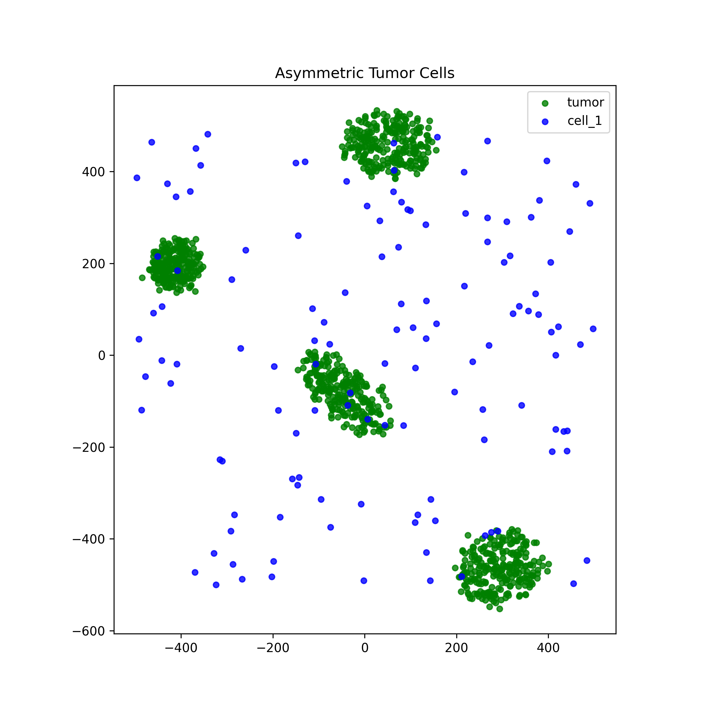
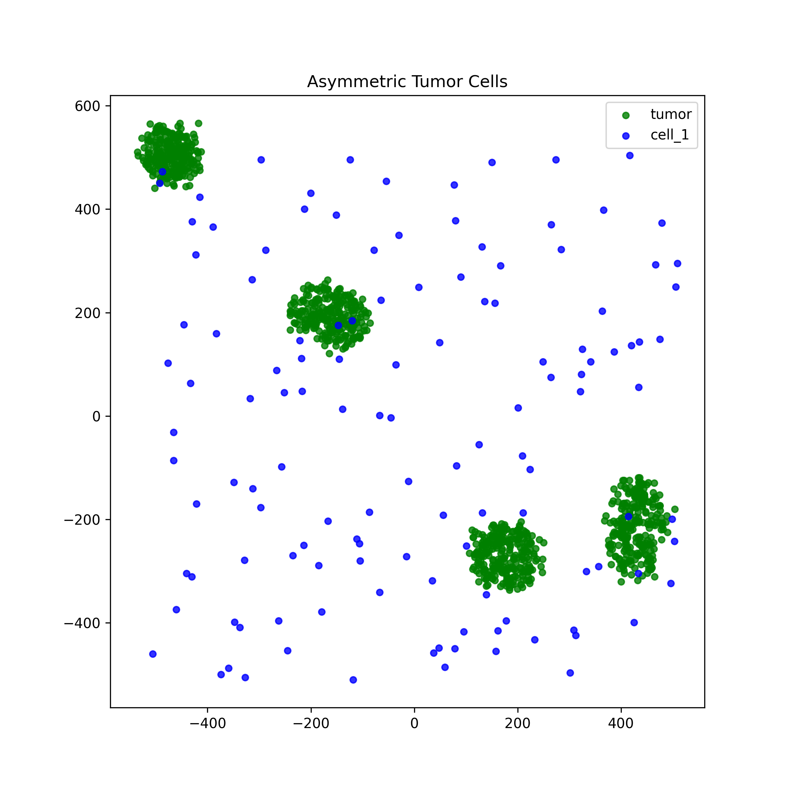
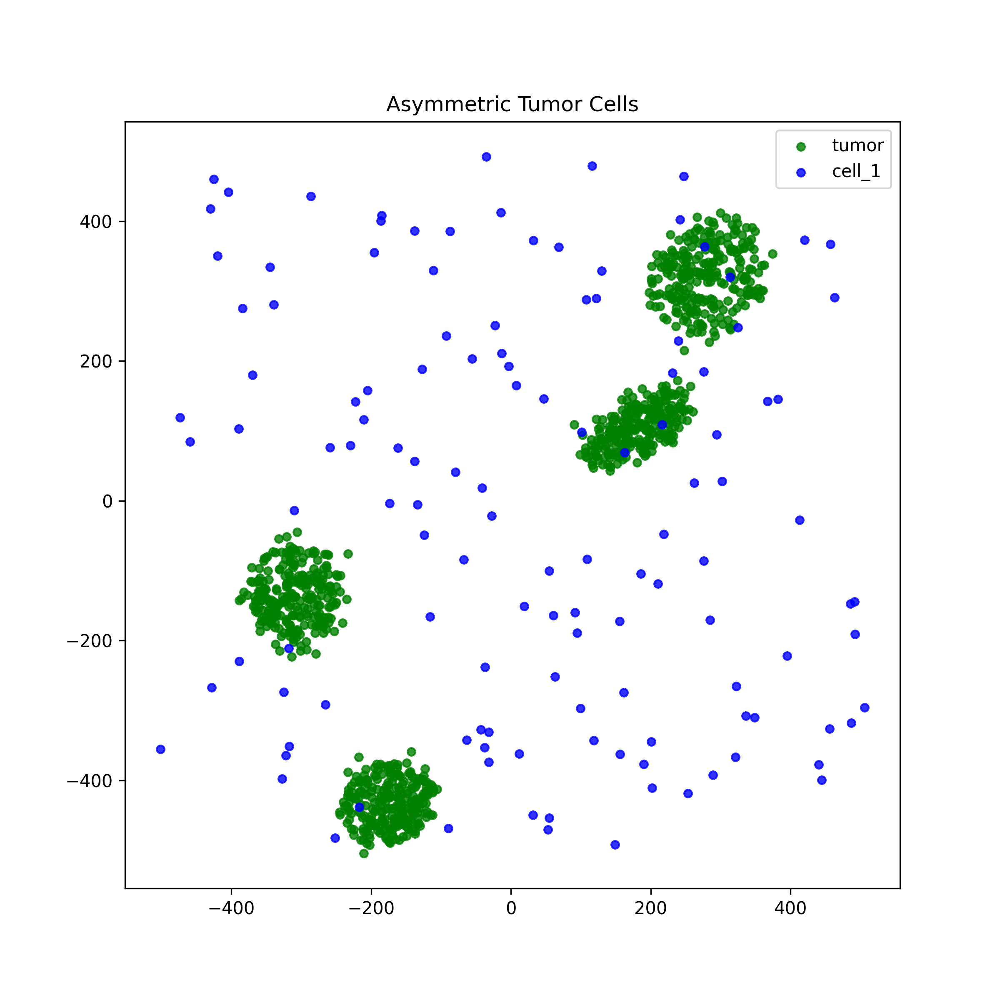
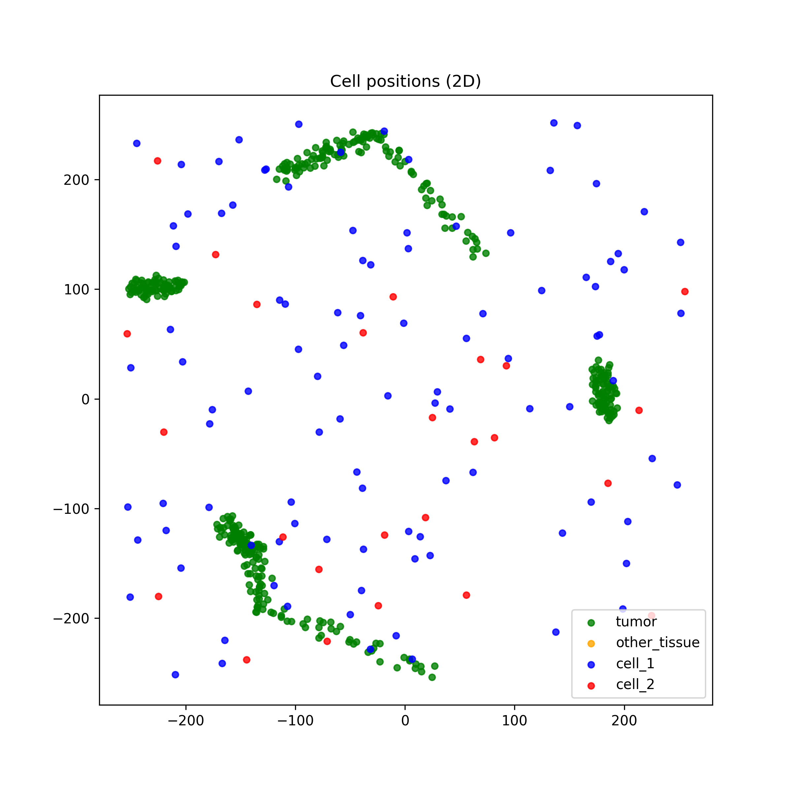
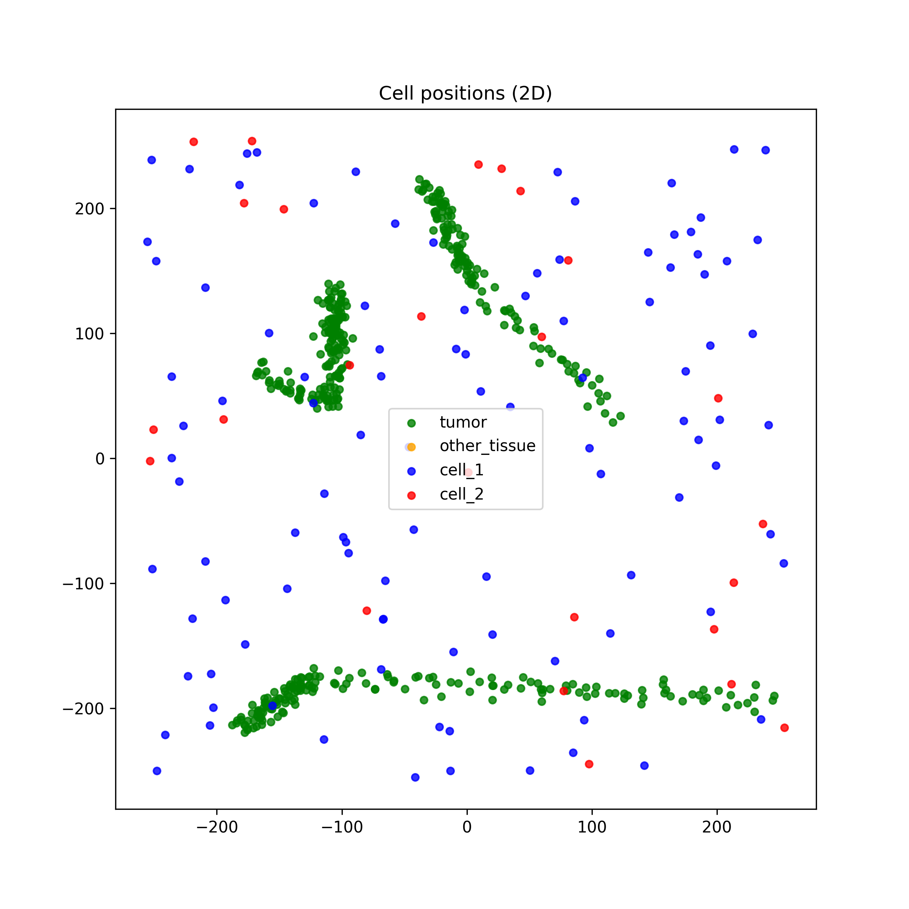
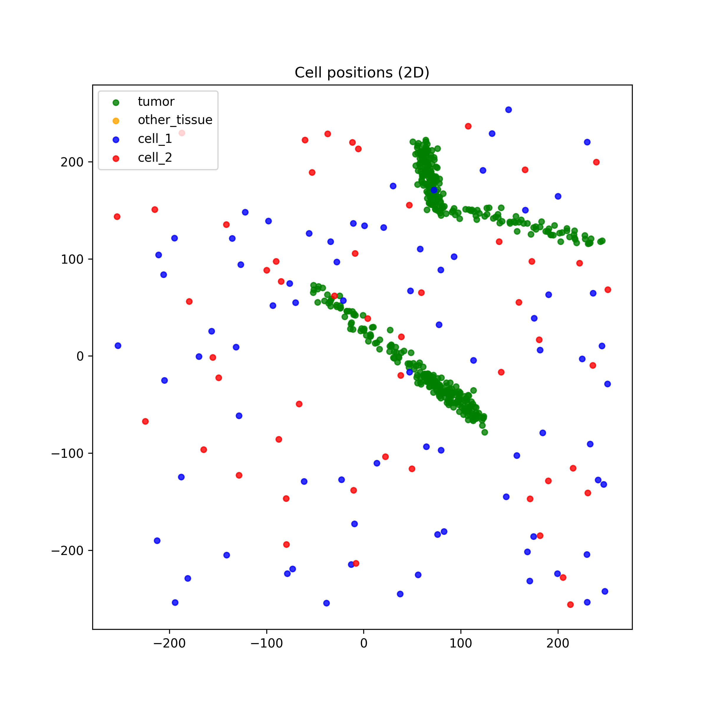

# Problem of Memory
If too many environments run in parallel, the RAM may not be sufficient, which can lead to memory issues such as `bad::malloc`.

# Problem of Speed
There is competition between threads used by the RL algorithm, threads used by the different environments, and threads used by PyTorch, which can reduce performance.

# Vectorization 
Previously, vectorization could not be applied to Graphs, but this has been resolved by modifying the Graph part of our code.

# New State Space Added (DONE)
- KNN integration thanks to Tysserand.

# New Initial Conditions Added (DONE)

## Asymmetric Mode
Random cluster of cancer cells:  
  

## Connected MST Mode
Pick N random points, build a graph using KNN, and then connect linked nodes with cancer cells along the edges:  
  

# Vec + SAC

## Acceleration Thanks to Async SAC ( HAVE TO WORK ON IT)
We are spending too much time between neural network updates and environment steps.
Two main papers:  
- [Asynchronous Parallel Reinforcement](https://link.springer.com/article/10.1007/s00366-024-02093-w?utm_source=chatgpt.com)  
- [Asynchronous A3C on GPU](https://www.researchgate.net/profile/Iuri-Frosio/publication/310610848_GA3C_GPU-based_A3C_for_Deep_Reinforcement_Learning/links/583c6c0b08ae502a85e3dbb9/GA3C-GPU-based-A3C-for-Deep-Reinforcement-Learning.pdf)

# My Plan
- Be more careful about the allocation of threads between the vectorized PhysiCell environments and the RL algorithm, PyTorch, and Replay Buffer. The code should be updated so that the first three threads are assigned to the RL algorithm, PyTorch, and Replay Buffer.  
- Make the code more similar to Async SAC, inspiration from the two articles above.
- Add PPO.
